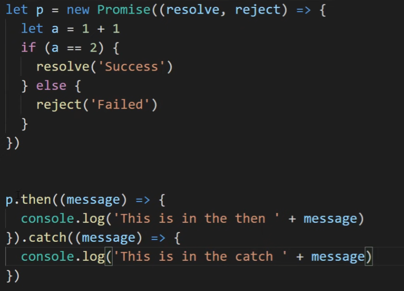

- es5实现继承
原型链?
- promise原理与实现promise★,顺便async/await
promise我又来了!!
是一个对象，表示异步操作完成或者失败的结果。
创建promise时，作为异步操作结果的代理放入同步程序中
pending,fulfilled,rejected

async与awaut可以拆开写，不用一直.then()
- css选择器
id选择器，class选择器，分组，嵌套选择器
- 事件模型
JS与HTML交互通过事件实现，事件流可以分为事件冒泡与事件捕获