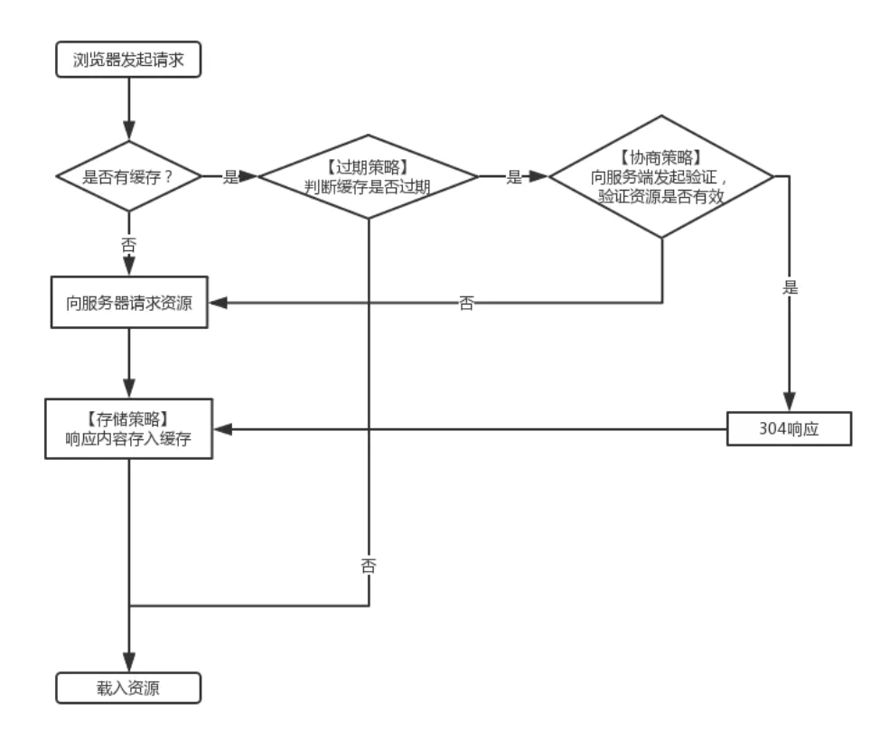

- 闭包作用与原理

- BFC，作用，形成
块级作用上下文
作用：1.margin塌陷 2.内部浮动清除
形成：overflow: hidden; display: inline-blobk; ...
- 浏览器缓存策略
强缓存是不发起请求，直接使用缓存内的内容的。浏览器将js、css、image、font-family等存到内存(存小文件)或者磁盘（存大文件）中，下次用户再访问的时候就从内存中取，以便提升性能。
协商缓存需要往后台发请求， 通过判断来决定是使用协商缓存。如果请求内容没发生变化，则请求返回304（服务器收到请求，但内容无变化），浏览器就用缓存内的内容。

- http2.0
- 前端模块化机制