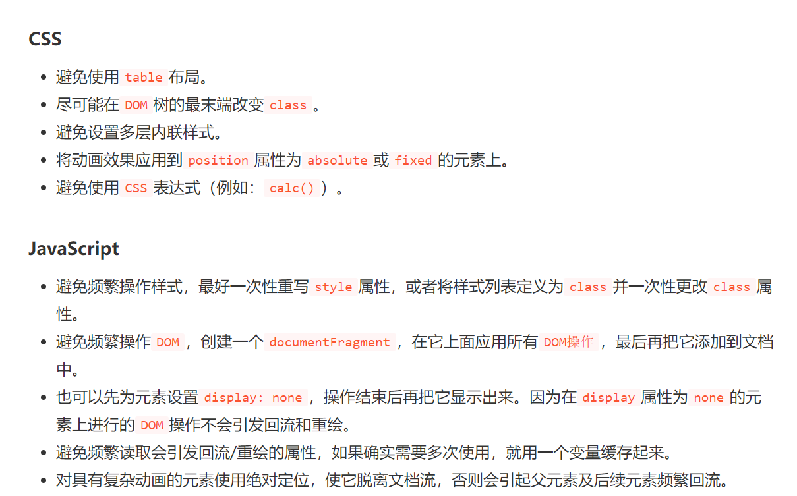
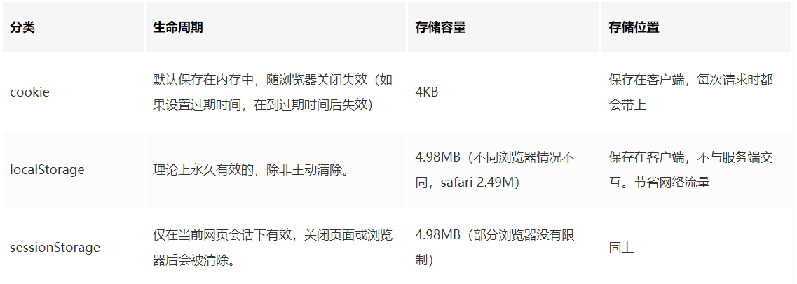
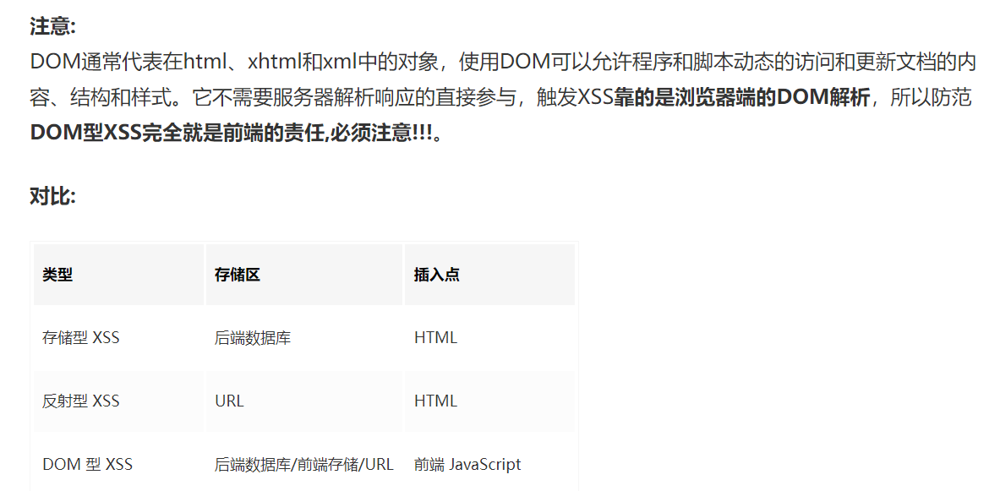

### html5新特性，input标签
canvas, video audio, nav header footer
type: 颜色，时间，年月日，区间值，搜索，电话邮件网址

### 浮动的副作用，解决
元素浮动之后，周围的元素会重新排列，为了避免这种情况，使用 clear 属性。

### 重绘，回流
HTML-->DOM  CSS-->CSSOM 合并生成渲染树，浏览器通过遍历渲染树计算各节点位置等等相关并展示于页面
**回流（Reflow）**:渲染树中的元素大小位置属性变化，需要重新走一遍或部分走一遍渲染树
**重绘（Repaint）**:样式颜色改变，不改变在文档流的位置，不用走渲染树
如何避免？：

### 浏览器渲染流程（输入url到页面完成）
#### local storage, session storage, web storage

### 首屏加载慢及优化
代码：懒加载
网络：CDN，本地缓存
引申骨架屏
### BFC？？
BFC 全称：Block Formatting Context， 名为 "块级格式化上下文"。
W3C官方解释为：BFC它决定了元素如何对其内容进行定位，以及与其它元素的关系和相互作用，当涉及到可视化布局时，Block Formatting Context提供了一个环境，HTML在这个环境中按照一定的规则进行布局。
简单来说就是，BFC是一个完全独立的空间（布局环境），让空间里的子元素不会影响到外面的布局。那么怎么使用BFC呢，BFC可以看做是一个CSS元素属性
### http https http缓存
### 原型链
### xss csrf
XSS：代码注入攻击，在目标网站上注入恶意脚本，在用户浏览器运行
存储型：到数据库 反射型：特殊的URL 

### 跨域
vue-->vite反向代理配置
### 发布订阅者模式
### 手撕简单轮播图
### 异步三种
Promise+Generator+async/await

### ajax原理
### es6新特性
扩展运算符，解构赋值取值，拼接字符串${}，数组扁平化flat，可选链操作符，异步async/await
### 垂直水平居中布局
绝对定位+负margin
绝对定位+transform:translate
flex/grid
table-cell?
### eventloop
Event Loop即事件循环，是指浏览器或Node的一种解决javaScript单线程运行时不会阻塞的一种机制
主线程（执行栈）--异步处理模块--任务队列
#### 防抖， 节流用在哪
### vuex的module
### 箭头函数
this：箭头函数的this永远指向定义时候的上层作用域的this，不变
无arguments 不能做构造函数
22.动画
23.函数柯里化
24.如何用flex实现grid
25.position
26.cookie,token
27.vue生命周期
28.rem em px
